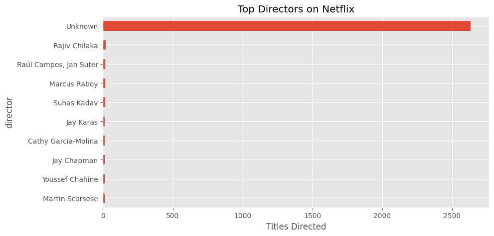

Netflix Content Analysis using Python, Pandas & Matplotlib

Exploratory Data Analysis (EDA) project focused on understanding Netflix's content trends, growth patterns, genre distribution, ratings, country-wise contributions, and content expansion over time.

--------------------------------------------------------------------------------

Project Overview

This project analyzes Netflix's content library using Python, Pandas, NumPy, and Matplotlib.

The objective is to perform Exploratory Data Analysis (EDA) on Netflix's Movies and TV Shows dataset to uncover trends in content growth, genre popularity, content ratings, country-wise distribution, and director contributions.

Through this analysis, meaningful insights are generated to understand Netflix's content strategy and catalog expansion over time.

--------------------------------------------------------------------------------

Problem Statement

Netflix hosts thousands of movies and TV shows from different countries and genres. Understanding content distribution, growth patterns, ratings, and production trends can help identify how Netflix has expanded its catalog over the years.

This project aims to answer key business questions through data analysis and visualization.

--------------------------------------------------------------------------------

Dataset Information

Dataset: Netflix Movies and TV Shows Dataset

Total Records: 8,807+

Features Included:

• Title  
• Type (Movie / TV Show)  
• Director  
• Cast  
• Country  
• Release Year  
• Rating  
• Duration  
• Genre  
• Date Added  

--------------------------------------------------------------------------------

Tools & Technologies Used

• Python  
• Pandas  
• NumPy  
• Matplotlib  
• Google Colab  
• Jupyter Notebook  

--------------------------------------------------------------------------------

Skills Demonstrated

• Data Cleaning  
• Exploratory Data Analysis (EDA)  
• Data Visualization  
• Feature Engineering  
• Pandas Data Manipulation  
• Trend Analysis  
• Business Insight Generation  
• Python Programming  

--------------------------------------------------------------------------------

Data Cleaning Process

The following preprocessing steps were performed:

• Checked for missing values

• Handled null values in relevant columns

• Converted date_added column into datetime format

• Extracted Year Added and Month Added for trend analysis

• Standardized data for analysis and visualization

• Prepared the dataset for exploratory analysis

--------------------------------------------------------------------------------

Business Questions Answered

1. Movies vs TV Shows Distribution

What percentage of Netflix content consists of Movies and TV Shows?

2. Top Countries Producing Netflix Content

Which countries contribute the most content to Netflix?

3. Netflix Content Growth Over Time

How has Netflix's content library grown over the years?

4. Most Common Genres

Which genres dominate Netflix's catalog?

5. Rating Distribution

What are the most frequently used content ratings?

6. Monthly Content Addition Trends

Are there specific months when Netflix adds more content?

7. Top Directors on Netflix

Which directors have the highest number of titles on Netflix?

8. Movie vs TV Show Growth Analysis

How has content production evolved across content types?

--------------------------------------------------------------------------------

Project Visualizations

Movies vs TV Shows Distribution

Observation:

Movies significantly outnumber TV Shows on Netflix, indicating a stronger focus on movie content.

--------------------------------------------------------------------------------

Top Countries Producing Netflix Content

Observation:

The United States contributes the highest number of titles, followed by a few major international markets.

--------------------------------------------------------------------------------

Netflix Content Growth Over Time

Observation:

Netflix experienced rapid content growth after 2016, reflecting aggressive catalog expansion.

--------------------------------------------------------------------------------

Genre Distribution

Observation:

Drama and International Movies are among the most common genres available on the platform.

--------------------------------------------------------------------------------

Rating Distribution

Observation:

TV-MA is the most common content rating, showing a strong presence of mature content.

--------------------------------------------------------------------------------

Monthly Content Addition Trend

Observation:

Content additions vary throughout the year, suggesting seasonal release patterns.

--------------------------------------------------------------------------------

Top Directors on Netflix

Observation:

A small number of directors contribute multiple titles, while most directors appear only once.

--------------------------------------------------------------------------------

Key Insights

• Movies dominate Netflix's content catalog compared to TV Shows.

• The United States is the leading contributor of Netflix content.

• Netflix witnessed major content growth after 2016.

• Drama and International Movies are among the most common genres.

• TV-MA is the most frequently used rating category.

• Content additions display seasonal trends across different months.

• Director contributions are concentrated among a limited number of creators.

--------------------------------------------------------------------------------

Recommendations

Based on the analysis, the following observations may be useful:

• International content continues to play an important role in Netflix's catalog growth.

• Popular genres such as Drama and International Movies could remain key focus areas.

• Seasonal content addition patterns may help in understanding release strategies.

• Regional content strategies can strengthen Netflix's presence in emerging markets.

--------------------------------------------------------------------------------

Project Structure

Netflix-Content-Analysis/

│

├── Netflix_Analysis.ipynb

├── netflix_titles.csv

├── movies_vs_tv.png

├── top_countries.png

├── growth_over_time.png

├── genres.png

├── ratings.png

├── monthly_content.png

├── top_directors.png

└── README.md

--------------------------------------------------------------------------------

Future Improvements

• Build an interactive Power BI Dashboard

• Develop a Streamlit Web Application

• Perform advanced genre trend analysis

• Analyze country-wise content growth patterns

• Add interactive visualizations using Plotly

--------------------------------------------------------------------------------

Learning Outcomes

Through this project, I gained practical experience in:

• Data Cleaning

• Exploratory Data Analysis (EDA)

• Data Visualization

• Business Insight Generation

• Python Programming

• Pandas & NumPy Operations

• Trend Analysis

• Data Interpretation and Reporting

--------------------------------------------------------------------------------

Author

Sakshi Kale

--------------------------------------------------------------------------------

Project Status

Completed

This project demonstrates the application of Python, Pandas, NumPy, and Matplotlib for data cleaning, exploratory data analysis, visualization, and insight generation using real-world Netflix content data.
