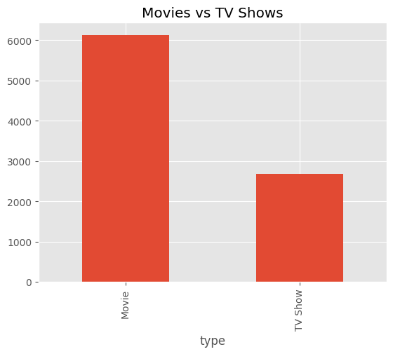
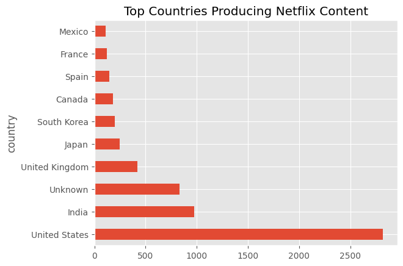
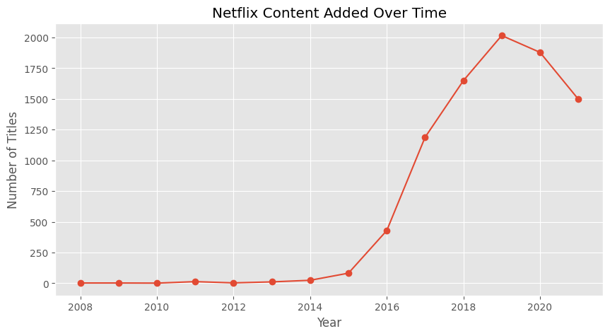
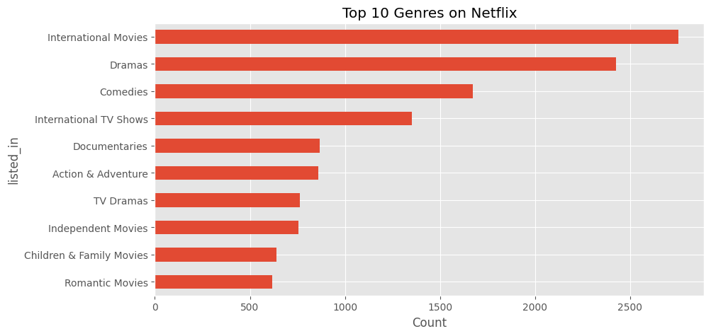
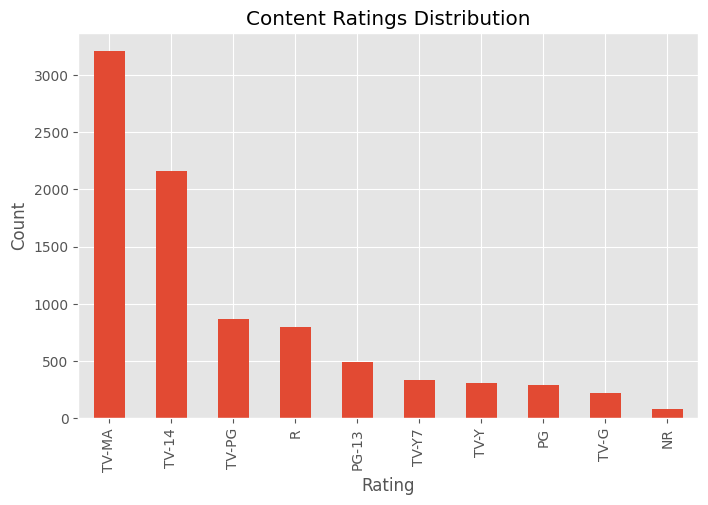
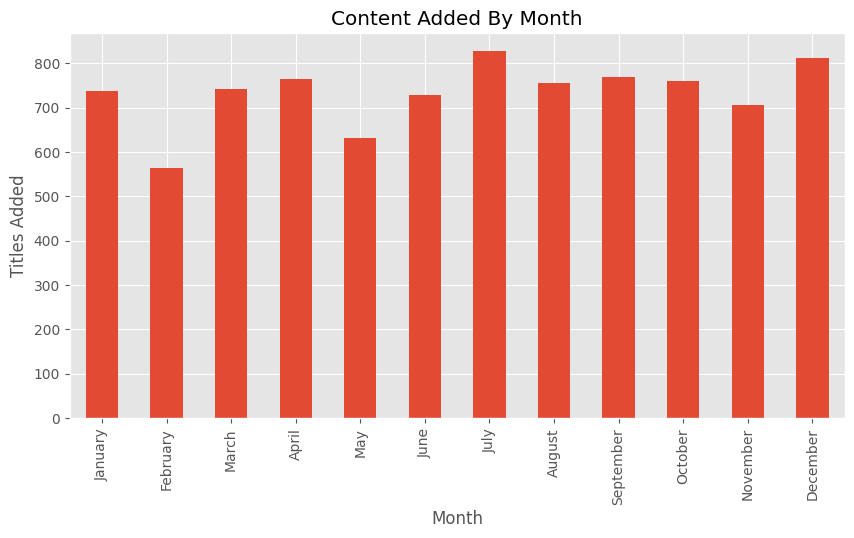

Netflix Content Analysis

Project Overview

This project analyzes Netflix's content library using Python, Pandas, and Matplotlib.

The objective was to perform Exploratory Data Analysis (EDA) to uncover trends in content growth, genre distribution, ratings, countries, directors, and content release patterns.

------------------------------------------------------------

Tools Used

- Python
- Pandas
- NumPy
- Matplotlib
- Google Colab

------------------------------------------------------------

Dataset

Netflix Movies and TV Shows Dataset

Total Records: 8807+

------------------------------------------------------------

Business Questions Answered

1. Movies vs TV Shows Distribution
2. Top Countries Producing Netflix Content
3. Netflix Content Growth Over Time
4. Most Common Genres
5. Rating Distribution
6. Monthly Content Addition Trends
7. Top Directors on Netflix
8. Movie vs TV Growth Analysis

------------------------------------------------------------

Key Insights

• Movies dominate Netflix's content catalog.

• The United States contributes the highest amount of content.

• Netflix experienced rapid content growth after 2016.

• Drama and International Movies are among the most common genres.

• TV-MA is the most common content rating.

• Certain months show higher content additions than others.

------------------------------------------------------------

Movies vs TV Shows

------------------------------------------------------------

Top Countries Producing Netflix Content

------------------------------------------------------------

Netflix Content Growth Over Time

------------------------------------------------------------

Genre Distribution

------------------------------------------------------------

Content Ratings Distribution

------------------------------------------------------------

Monthly Content Addition Trend

------------------------------------------------------------

Top Directors on Netflix

------------------------------------------------------------

Project Files

- Netflix_Analysis.ipynb
- netflix_titles.csv
- movies_vs_tv.png
- top_countries.png
- growth_over_time.png
- genres.png
- ratings.png
- monthly_content.png
- top_directors.png

------------------------------------------------------------

Author

Sakshi Kale
